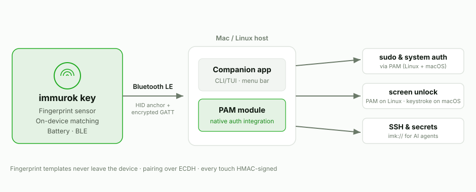

Touch ID is excellent when it is built into the machine or keyboard. The awkward part starts everywhere else: Mac mini, Mac Studio, closed-lid MacBooks, external keyboards, Linux desktops, and terminal-heavy workflows.

immurok is my attempt to build a small wireless fingerprint key for those setups.

It is *not* meant to be "Apple Touch ID, but external." Touch ID is Apple's own secure platform, deeply fused into the Secure Enclave and the OS. immurok is something more modest and more honest about its scope: a **local-first desktop authentication device** with clear limits.

## Where built-in fingerprint auth runs out

If you use a laptop with the sensor under your thumb, none of this is your problem. But a lot of desktop computing doesn't look like that:

- **Mac mini and Mac Studio** ship with no fingerprint reader at all. Apple's only first-party answer is a $199 Magic Keyboard with Touch ID.
- **A MacBook in clamshell mode**, driving an external display, can't reach its own sensor — the lid is closed.
- **External keyboards** — and especially mechanical keyboards, which a lot of developers prefer — have no biometric story on macOS unless you buy Apple's specific keyboard.
- **Linux desktops** can do fingerprint auth through `fprintd`, but good, well-supported hardware is genuinely scarce, and setup is fiddly.
- **Terminal-heavy workflows** are the worst case: you `sudo` a dozen times an hour, sign Git commits, SSH into boxes — and every one of those is a password prompt.

The common thread is that biometric auth is *welded to specific hardware*. The moment your setup steps outside that hardware, you're back to typing passwords.

## What immurok actually is

A small wireless key with a capacitive fingerprint sensor that pairs to your computer over Bluetooth LE. Concretely, its scope is:

- **Linux `sudo` and system authentication through PAM.** This is the cleanest integration — see below for why it matters.
- **A Linux CLI/TUI app** for pairing, status, and local control — no GUI required, built for people who live in the terminal.
- **macOS `sudo` / system-prompt support through PAM integration**, for the auth prompts that *do* consult PAM.
- **Mac desk-setup workflows** — Mac mini, Studio, clamshell, external keyboards — where Touch ID is missing or impractical.
- **Fingerprint matching on the device.** Your fingerprint template is enrolled and matched on the key itself; it never travels over Bluetooth, never lands on your disk, and there is no cloud to send it to.
- **Open-source companion software.** The macOS app, the Linux app, and the PAM modules are open source under Apache 2.0. The firmware and hardware design are source-available under BSL 1.1, converting to Apache 2.0 in 2030 — everything is on GitHub for you to read, build, and flash.

It is deliberately a single-purpose device. No screen, no account, no app store — a key that proves a fingerprint touch happened, and lets your OS act on it.

## The distinction that matters: PAM, not a typed password

Here is the part I most want to be clear about, because it's the easiest thing to get wrong when you build something like this.

For `sudo` and system authentication, **immurok is not just typing a stored password for you.** A lot of "fingerprint unlock" gadgets are really just a biometric trigger wired to a password autotyper: they keep your password somewhere, and when you touch the sensor they replay it into the prompt. That works, but it means your password is sitting in storage, and anything that can see the keystrokes sees your password.

On **Linux**, immurok integrates through **PAM** — the same authentication framework `sudo`, login, and `polkit` already use. When you run `sudo`, the PAM stack asks immurok's module, the module checks with your paired device over an authenticated channel, you touch the sensor, and PAM gets back a real *success/failure* result. There's no stored password being replayed — the authentication decision flows through the OS's own auth pipeline, the way a fingerprint *should*.

On **macOS** the picture is split, and it's worth being precise:

- For prompts that consult PAM — `sudo` in a terminal, some system dialogs — immurok integrates through PAM the same way.
- For the **lock screen**, macOS doesn't let third-party PAM modules dismiss the login window or screensaver. So for that one flow, immurok falls back to keyboard simulation: it keeps your login password in the macOS Keychain and types it *only after* verifying a cryptographically signed match from your device. It's the autotyper approach — but scoped to the single case the OS forces it into, gated behind a verified touch, and nowhere else.

That asymmetry isn't a limitation we're hiding; it's a property of the platforms. Linux exposes a clean biometric path through PAM end to end. macOS exposes it for some flows and walls off the lock screen. immurok uses the real path wherever the OS offers one.

## Honest about the limits

immurok is local-first and deliberately narrow. It does **not** replace the Secure Enclave, it does **not** integrate with App Store purchases or `LAContext` the way Apple's own biometrics do, and it does **not** pretend to be Touch ID. It is a wireless fingerprint key for the desktop setups Apple and the Linux ecosystem left without a good option — with the matching done on the device, the secrets kept off your disk, and the security model [written up in full](/blog/the-immurok-security-model/) so you don't have to take any of this on faith.

If your desk is one of the awkward setups above, that's exactly who I built it for. The macOS app, PAM module, and Linux app are [on GitHub](https://github.com/immurok); the device is [live on Kickstarter](https://www.kickstarter.com/projects/immurok/immurokwireless-fingerprint-auth-key-for-mac-and-linux).
