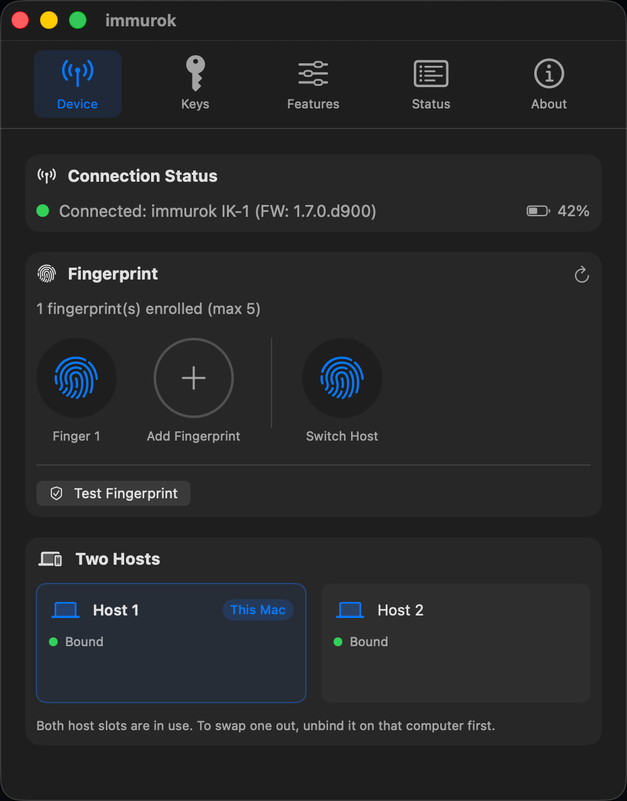
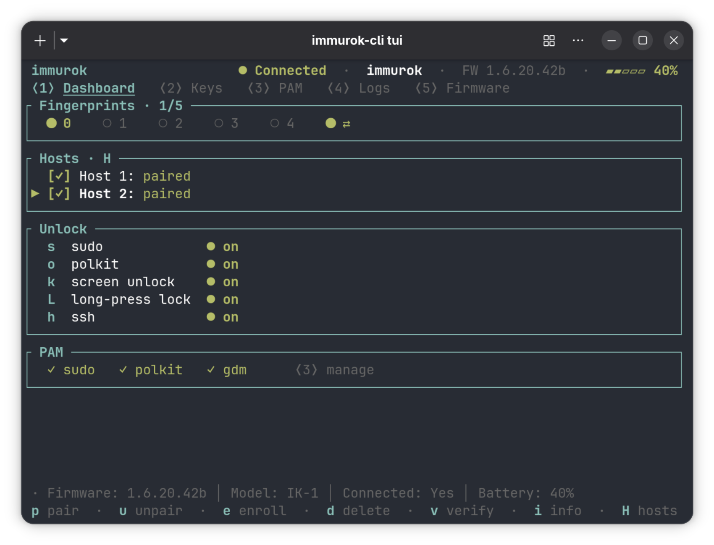

The most common thing people told us after the first firmware shipped was simple: they have two computers. A work Mac and a personal one. A Mac on the desk, a Linux laptop in the bag. Nobody wants to buy and enroll a second key for the second machine.

So we added dual-host. One key, paired to two computers, switched with a fingerprint. It shipped in firmware 1.7.0. Here's how it works.

## Why one key can't just talk to both

immurok connects as a bonded Bluetooth device. That bond is what lets the key sit in your pocket and reconnect the moment you sit down, with nothing to approve. It's also 1-to-1: one bond, one computer. It's the same reason your phone sometimes can't decide which speaker to join.

We could have made the key answer to anyone, but that's the wrong default for an authenticator. Its whole job is proving you're there. So each computer's trust had to stay separate.

## Two slots, two identities

The trick is that the key presents itself as two different devices. Inside there are two slots, each with its own Bluetooth address and its own bond. When it's serving the first computer, it shows one identity. Switch to the second, and it shows another. Each computer just sees "my immurok key" and reconnects. Neither one knows the other is there.

*The macOS app's Two Hosts panel: both slots bound, each its own identity, with a Switch Host fingerprint sitting next to your regular ones.*

## Switching with a fingerprint

Something has to flip between the two. We didn't want a button combo or a toggle buried in an app, so switching is just a fingerprint. You enroll a switch finger, and pressing it hands the device to the other computer, which reconnects on its own. Same gesture as everything else, different finger.

## Adding the second computer, safely

This was the hard part. Adding a host to a key that lives in your pocket is sensitive. If the key gets lost or borrowed for five minutes, pairing a new computer to it must not be something a stranger can do.

We first tried a temporary PIN, shown on one computer and typed into the other. Then we threw it out. It added a screen, a code to copy, and it was visible to anyone looking over your shoulder.

What we shipped needs two physical steps and nothing to type. First you touch a fingerprint the key already knows, to prove you're the owner. Then you press the button on the device, to prove you're holding it right now. Both happen in your hand. A found key does nothing without both.

## Leaving without losing the other machine

Say you sell the personal Mac but keep the work one. You want that host gone for good, so the sold machine can never quietly reconnect, without touching the computer you're keeping.

Removing a host clears its slot and gives it a fresh Bluetooth address. The old computer, even with its saved bond, simply never sees the key again. The slot you kept stays exactly as it was: same address, same keys, no re-pairing. And it doesn't wipe the whole key. Being done with one computer shouldn't cost you the other one or your fingerprints.

## The limits, honestly

Two hosts, not ten. That's on purpose. Two covers the common case (work and personal, desktop and laptop, Mac and Linux) and keeps the security easy to reason about. As with everything on the device, your fingerprint never leaves the key. Both computers only ever get a yes or no.

## Try it

Dual-host is live in firmware 1.7.0, on both the macOS app and the Linux companion.

*The Linux companion carries the same model into the terminal: a Hosts panel under `H`, and the switch finger on the fingerprint row.*

It's all on GitHub if you want to read the code. One key, two computers, one finger to move between them.
