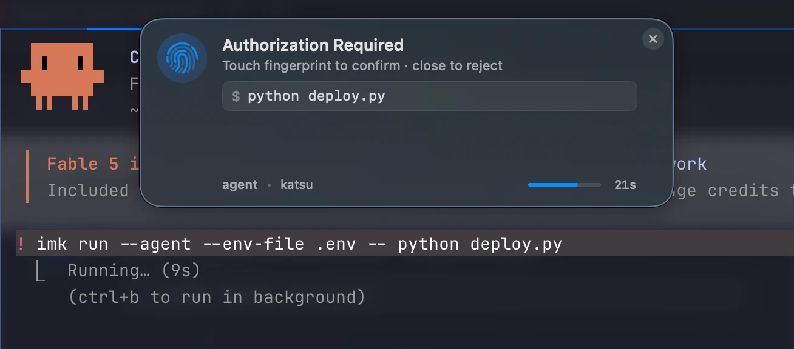

Your AI coding agent now writes code, runs the tests, restarts the daemon, pushes the branch, and tails the prod logs. Most of those last four want **sudo**, **SSH signing**, or **API keys**. None of those want to type a password.

The industry's current answer is one of:

- give the agent passwordless `sudo` and a long-lived SSH key — and pray;
- have the agent prompt you for a password every two minutes — and ragequit;
- run the agent inside a sandbox so locked down it can't actually finish the work.

immurok offers a fourth option: **let your fingerprint be the agent's signature**.

## The wrap

```bash
imk run --agent -- sudo systemctl restart api
imk run --agent -- git push origin main
imk run --agent --env-file .env -- python deploy.py
```

When the agent calls `imk run --agent --`, the immurok companion app pops a HUD overlay at the top of your screen. The overlay shows the verbatim command, highlights any `imk://` URI it sees in bold, and waits up to 30 seconds. Touch the device — the wrapped subprocess runs. Close the overlay or let it time out — the subprocess gets `SIGTERM`, and the agent receives exit code `77` (`EX_NOPERM`), which it treats as a hard "no, abort".

One touch covers the **whole** subprocess. While the wrap is running:

- `sudo`'s PAM module finds an active 5-minute pre-auth and skips its own prompt.
- The device's AUTH cooldown also satisfies SSH key signing (`KEY_SIGN`), OTP reads (`KEY_OTP_GET`), and API secret reads. So if the wrapped script does `git push` (which signs over SSH) followed by `curl -H "Authorization: $(imk get imk://api/foo)"`, both work without re-prompting.
- The instant the user closes the overlay, the cooldown drops and the subprocess is killed mid-flight. No half-applied state.

This is the property that makes the agent flow tractable: the agent doesn't get spammed at every privilege boundary, and the user doesn't get fatigued into rubber-stamping. One command in the overlay, one touch.

## Secrets without the disk hop

The other half of the AI-agent problem is API keys. The agent reads its `.env`, sees the key, and now the key is in the agent's context — possibly the cloud provider's logs, possibly auto-included in a prompt to a model provider you don't control.

immurok introduces an `imk://` URI scheme:

```
# .env
OPENAI_KEY=imk://api/openai
GITHUB_TOKEN=imk://api/github
```

When the agent runs `imk run --agent --env-file .env -- python deploy.py`, the CLI:

1. Parses `.env`, finds the `imk://` URIs.
2. Asks the device (under fingerprint cooldown) to release the actual secret values.
3. Injects them into the **child process's** environment at `exec()` time.
4. The agent, the parent shell, and the agent's transcript never see the resolved values.

The HUD bolds any `imk://` URI it finds in the command string, so the user always sees which keys are being read.

## Reject = clean kill

This is the bit that took the longest to get right. When the user clicks the close button on the overlay (or the 30-second timer fires), we don't want a half-running subprocess sitting there waiting for the never-coming approval signal. We want it dead, *now*, with a status code that's distinct from "process crashed".

- The companion app sends `GATE_CANCEL` to the device immediately, releasing the AUTH queue hold.
- The CLI sends `SIGTERM` to the wrapped subprocess.
- The subprocess exits; the wrap exits with `77`.
- The agent's command runner sees `77`, classifies it as user-denial, and aborts the workflow without retrying.

Linux users get a GTK4 dialog with a live countdown and a Cancel button (we used `notify-send` until we got tired of fighting its DBus quirks). macOS users get a native overlay. Both treat 30 s as a hard SLA.

## Drop-in via imk-skill

We maintain a [single-file markdown skill](https://github.com/immurok/imk-skill) — `using-imk` — that teaches the agent the wrap pattern, when to apply it, and what to do when things go wrong.

- **Claude Code** — `/plugin marketplace add immurok/imk-skill && /plugin install imk-tools@imk`
- **Cursor / Cline / Continue / Windsurf** — vendor into `.cursorrules` / `.clinerules` / `.continue/rules.md`
- **Codex / Aider / Gemini CLI** — append to `AGENTS.md` / `CONVENTIONS.md` / `GEMINI.md`

Once the skill is loaded, the agent recognises the triggers (`imk` on `$PATH`, `~/.immurok/` exists, `imk://` URIs in `.env`, project docs mentioning immurok) and starts wrapping commands automatically. The first time you watch your agent ask for a fingerprint before pushing to main, you understand why we built this.

## Why a hardware key, and not a software prompt?

A fair question: why not just have the OS prompt for an admin password every time the agent wants to do something privileged? The answer is twofold.

**The hardware path can be brokered.** Software password prompts are bound to whatever process raises them; the agent can't pre-warm sudo, can't share a single approval across `sudo` + `ssh` + `imk get`, and can't be cleanly cancelled. The companion app sees all three, so one fingerprint touch can release all three through a single broker.

**The fingerprint is the audit trail.** Every approval lights up a real fingerprint sensor. There's no "set it and forget it" mode where the agent runs unattended at scale. If you walk away from your desk, the agent stops being able to push code. That's the security property we wanted.

## What's next

We're shipping immurok for general availability later this year. The agent integration ships in App 1.13 + Firmware 1.3.x (already in the daily builds). The imk-skill is open from day one and works with any agent that reads a rules file.

If you'd like to try it, [back it on Kickstarter](https://www.kickstarter.com/projects/immurok/immurokwireless-fingerprint-auth-key-for-mac-and-linux). If you maintain an AI agent or coding assistant and want first-class immurok support, [open an issue on imk-skill](https://github.com/immurok/imk-skill/issues) — we'll add the rules file path for your platform.
