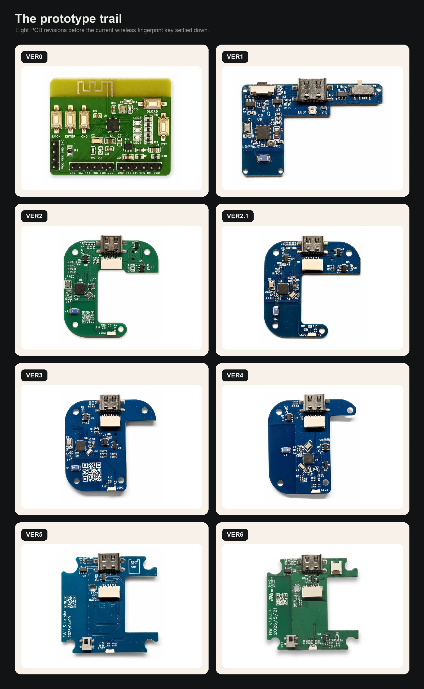
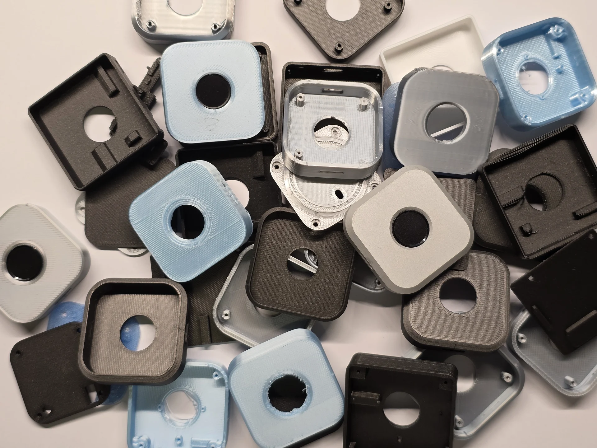
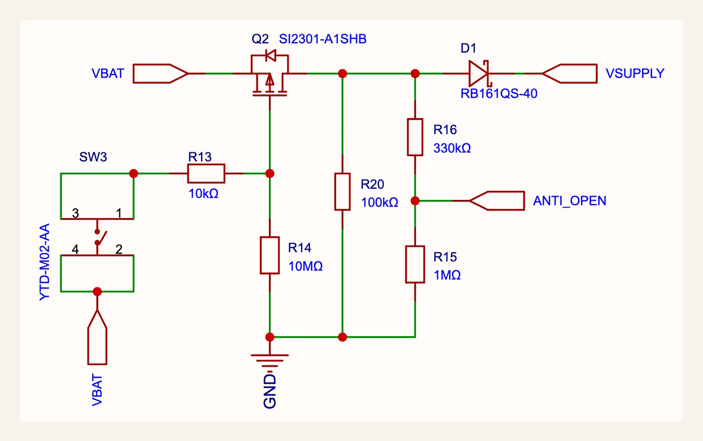

immurok is a small wireless fingerprint key: touch the sensor, approve the action, get back to work. It took eight PCB revisions to get there. These are the notes — the boards we scrapped, the parts that looked right until they met a battery, and the mechanical choices that worked in CAD and failed in plastic.

Four things drove most of the rework: keep the radio connected without draining the battery, make the sensor usable without it glowing like a toy, build an enclosure that survives assembly, and make the tamper switch actually do something.

## Picking the MCU: ESP32 was too power-hungry

The first prototypes used ESP32-S3 and ESP32-C3. Familiar, well documented, easy to bring up.

Then we looked at the power budget. immurok sits on a desk for weeks, wakes on touch, and does nothing the rest of the time. The number that matters is idle current, not peak current during BLE traffic. The ESP32 direction projected over 200 uA static before the design was even finished. For a battery-powered key, that drains the battery while the user is doing nothing.

So we moved to CH592F. Tighter RAM, less convenient, but it gave us the sleep budget a desk key needs. The shipping design idles around 40 uA, after a lot of measurement and firmware tuning — BLE intervals, sensor rails, pull resistors, LEDs, wake paths, and every GPIO default.

Takeaway: for a device that's supposed to disappear into the desk, the MCU choice is the product, not an implementation detail.

## Choosing a fingerprint sensor

Our first working path used ZW3021-class modules. They worked: enroll a finger, match locally, report over UART. The problem was the built-in lighting — blue rings, green glows, decorative LEDs that make sense on an access-control panel and look wrong on a desk. The light also costs power and complicates the enclosure.

For a while we had a promising module shaped like a ping-pong paddle. Mechanically it fit a small handheld object well, and it skipped the built-in-light problem. Then the vendor told us they couldn't support the volume we'd need for a real run. "Can I buy five?" and "Can I buy five thousand, repeatedly, without redesigning the product?" are different questions.

We settled on R559S: no light, on-module matching, fits the enclosure. It has one catch — after every power cycle, firmware must explicitly enable the touch interrupt switch. Most modules we tested do this automatically. On R559S, if firmware doesn't send the setup command after power is restored, touch no longer wakes the system.

This matters in the failure path. If firmware crashes before re-enabling the touch interrupt, the user can touch the sensor forever and nothing happens. So we treat the command as part of the power system, not a feature toggle: bring up the sensor early, and re-send the touch-interrupt command after every power transition.

## Why the board shape kept changing

The PCB revisions were half the story. The other half was a pile of failed enclosures: sensor holes a millimeter off, screw posts colliding with components, shapes that looked fine in CAD and felt wrong in the hand.

Each failed case pushed back on the board. The sensor opening set how far the module could sit from the edge. The screw posts set where copper couldn't go. The USB connector needed room for a cable and fingers. The antenna needed air, not a wall of plastic and metal. Button and LED positions changed once the enclosure became something you could actually press.

- **VER0** — proving the parts could talk: MCU, sensor, buttons, debug UART, BLE. A lab board, not a product.
- **VER1–2** — real mechanical constraints: USB connector placement, sensor flex routing, room for a switch, antenna clearance, how the device sits in the hand.
- **VER3–4** — consolidation. Components moved off the edges, power routing got cleaner, LED and button choices settled. Started to look like something that could survive assembly.
- **VER5** — added the tamper switch. The firmware already had a security model for radio attackers; the hardware needed an answer for someone holding the device.

The first version of that answer was incomplete.

## The tamper switch only worked while powered

VER5 could detect a case-open event while the device was powered and running. That sounds like the whole feature until you ask: what if the attacker turns the device off first?

With no power, the MCU never runs the tamper code. No flash erase, no red LED. A switch on a GPIO is useless if the chip isn't alive to read it.

The VER6 fix: opening the case has to power the MCU long enough to enter the wipe path, not just signal it. The tamper switch now drives a small power-bypass path through a MOSFET arrangement — opening the enclosure forces the supply on even if the device was off. The MCU sees `ANTI_OPEN` and boots straight into the tamper handler.

VER5 asked "can firmware notice the case opened?" VER6 asks "can opening the case create the electrical conditions firmware needs to wipe secrets?" Security features fail in the gap between those two questions.

## Chasing standby current

Once the architecture settled, the rest was current measurement. We bought a microamp meter for this, because the LED being off and the logs being quiet tells you nothing — a pull-up, a sensor rail, or a BLE parameter can quietly eat the battery.

**Status LED.** Early boards used a WS2812-style single-wire RGB LED: cheap, one data pin, any color. Measured, the internal controller drew ~0.5–1 mA even when visually off — more than the rest of the sleeping system. We dropped it for plain LED channels driven straight from GPIO. Costs a few pins, removes an always-on controller.

**Fingerprint UART.** Leaving the port configured while the module slept kept current paths alive through the IO pins. Turning the sensor off wasn't enough; the host-side UART pins also had to be parked so they didn't back-power or bias the module. On a low-power board, serial ports are part of the power design.

**Prompt behavior.** My first `sudo` prompt design flashed the LED, powered the fingerprint module, and waited for a touch. Wasteful — the user might hesitate or ignore the prompt while the sensor DSP is already awake. The current design keeps the heavy DSP unpowered during the prompt window; only the touch-detect path stays alive. We power the module only when the user actually touches it. That adds ~50 ms of wake latency but roughly halves the energy spent waiting for a finger.

The full checklist, applied every revision:

- Turn the fingerprint module fully off when not needed.
- Keep the touch-detect path alive without powering the whole sensor stack.
- Park the fingerprint UART pins in sleep so they don't leak current.
- Replace smart RGB LEDs with GPIO-driven LEDs.
- Increase BLE slave latency where possible, within Apple's connection rules.
- Re-check every revision — a pin that was safe in VER3 may be expensive in VER5.

The target was the whole product — battery, regulator, sensor, radio, GPIOs, board leakage — not a heroic number on a bare MCU. Around 40 uA standby is where it stopped asking to be charged.

## BLE connection parameters

BLE looked easy in the prototype: advertise, connect, expose a custom GATT service, send signed match events.

Shipping a battery-powered BLE device is fussier. Set interval, latency, and supervision timeout wrong and either the device stays too chatty and burns power, or the host decides the peripheral is misbehaving and drops it.

immurok presents as a BLE HID keyboard but keeps auth traffic on a private GATT service. HID gives the OS a reason to hold the connection; the custom GATT service handles pairing, challenge-response, and signed touch events without putting secrets in the keyboard channel.

Increasing slave latency is one of the most effective ways to cut current — the peripheral skips connection events and the radio sleeps longer. But Apple's rule has to hold: supervision timeout > max interval × (latency + 1) × safety factor. Too much latency and the connection gets fragile; too little and the battery pays for needless radio wakeups. It never shows up in a product render, but it's the difference between "there when I touch it" and "why is my key asleep again?"

## Takeaways

- ESP32-S3/C3 — familiar chips can be wrong for the battery.
- ZW3021-class modules — a sensor can work and still feel wrong.
- The ping-pong-paddle sensor — supply chain is a design constraint.
- R559S — one power-cycle quirk can reshape firmware boot order.
- VER5 — a tamper switch isn't a tamper response unless the MCU is powered to act.
- The microamp meter — don't trust your feeling on power.

Eight boards later: small because the boards got smaller, quiet because the power budget became real, dark because the sensor choice mattered, and able to wipe itself because case-open is now an electrical event, not a firmware wish.
